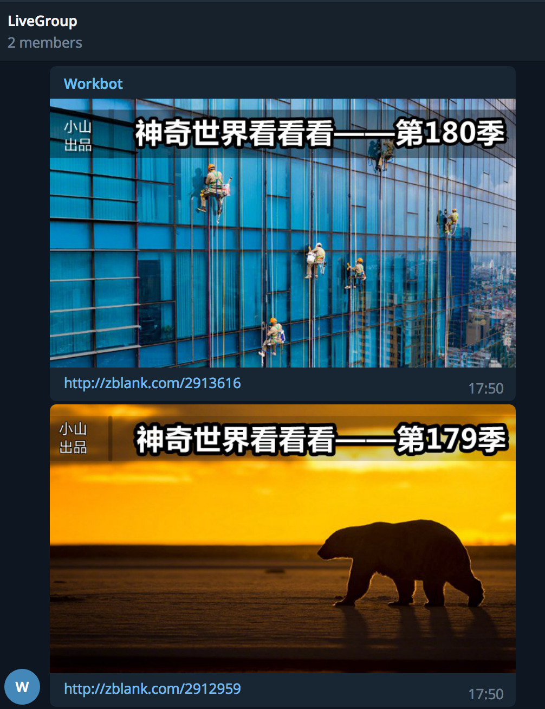

###《环球网 - 神奇世界看看看》！


### Telegram推送效果



### 模块准备
这里推荐使用[Anaconda](https://www.anaconda.com/download/)集成环境，自带各类常用第三方模块，更高效率开发。
 首先我们通过如下命令安装所需第三方模块
   ```
pip install tornado pyquery requests
```
   - [Tornado (web框架) ](https://pypi.python.org/packages/bb/92/766b36018312f3115ef174786dc978ebacfe28c68901c7278173c443abe6/tornado-5.0b1.tar.gz) 
   - [pyquery (数据抽取)](https://pypi.python.org/pypi/pyquery/1.4.0#downloads)
   - [requests (数据爬取)](https://pypi.python.org/pypi/requests/2.18.4#downloads) 

### 服务端实例效果图


